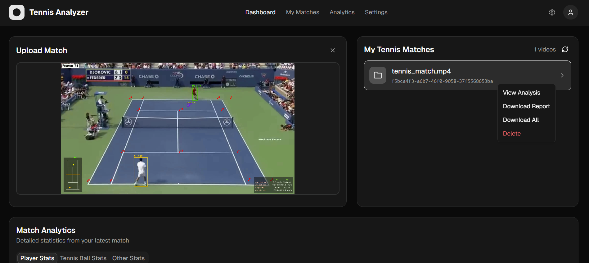
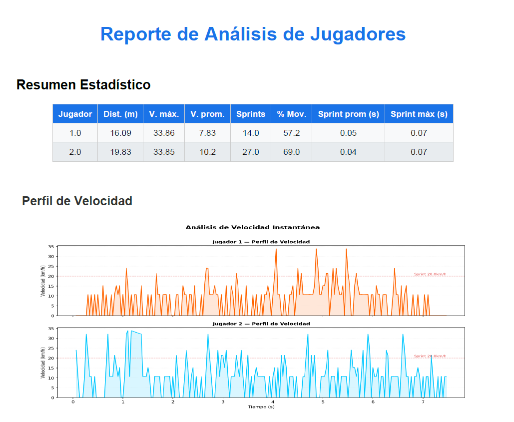
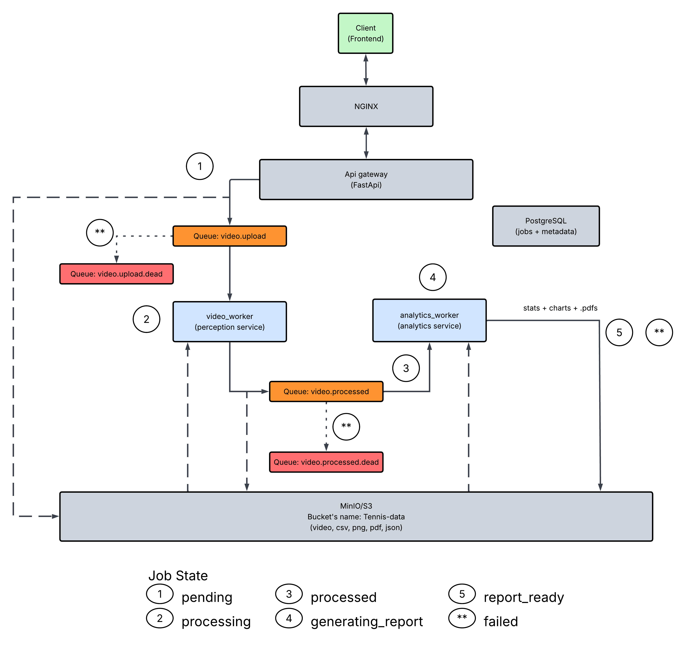
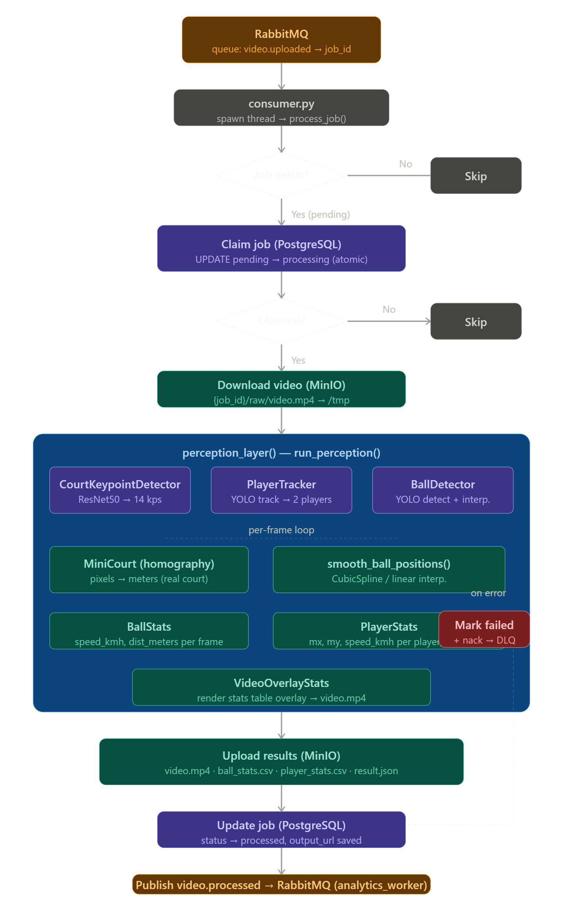
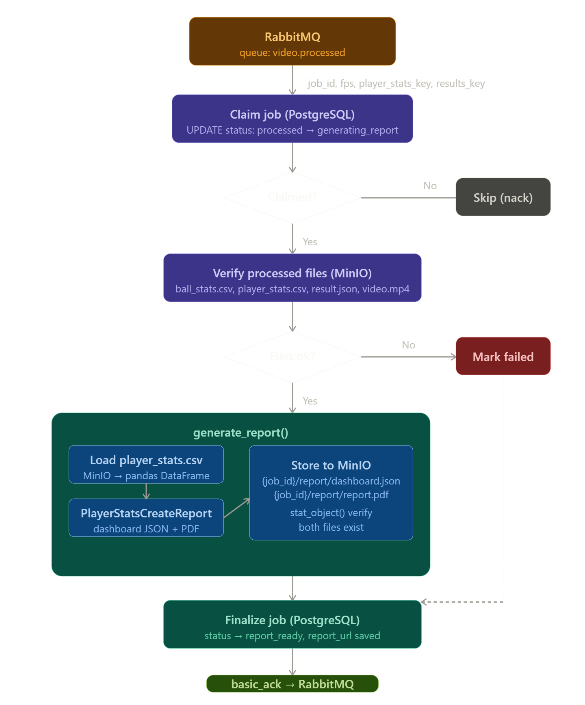
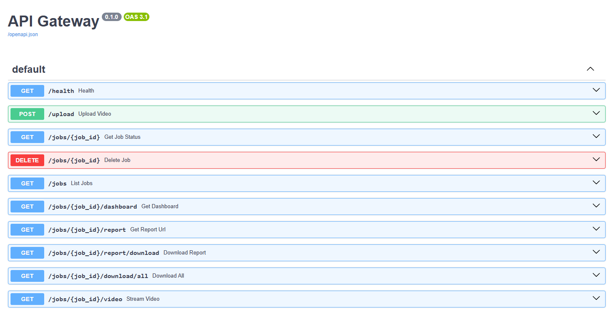

# 🎾 Tennis Data Analysis Engine

Tennis Data Analysis Engine is a platform that uses Computer Vision and MLOps designed to transform tennis match recordings into high-performance, professional metrics. The system uses a distributed, microservices-based architecture to process video, track players and balls, and generate detailed analytical reports in a scalable and robust manner.

<div align="center">
    
</div>
<br>

**Overview**

- Unlike conventional trackers, this engine integrates multiple Deep Learning models and projective geometry techniques to bridge the gap between video pixels and the physical reality of the court.

- Project Pillars:
    - Multi-Model Perception: Parallel implementation of YOLOv8 for object detection (players and ball) and ResNet50 for keypoint detection on the court.
    - Geometric Intelligence (MiniCourt): Homography engine that converts image coordinates into real-world meters, enabling precise calculation of distances, speeds, and tactical positioning.
    - Production-Grade Architecture: Asynchronous pipeline using RabbitMQ for message orchestration, PostgreSQL for atomic state persistence, and MinIO (S3) for storing artifacts and large files.
    - Resilience and Scalability: Distributed processing system with error handling via Dead Letter Queues (DLQ) and atomic claim mechanisms to ensure job integrity in high-concurrency environments.

<br>
<div align="center">
    
</div>
<br>


**Technology Stack**

- Deep Learning: PyTorch, Ultralytics (YOLO), torchvision.
- Image Processing: OpenCV (filters, tracking, and perspective transformations).
- Backend & API: FastAPI, Python 3.9+.
- Infrastructure: Docker & Docker Compose, RabbitMQ.
- Storage: PostgreSQL (Metadata), MinIO (Object Storage).
- Scripting & Automation: PowerShell (Infrastructure as Code for development).

<br>
<br>

# Project Architecture


<div align="center">
    
</div>
<br>

## Video Worker

The core of the video worker is the frame-by-frame loop where the three machine learning models (ResNet50 for keypoints, YOLO for players, and YOLO for the ball) run in parallel on each frame, with MiniCourt acting as the geometric bridge that converts pixels to real meters via homography.

The two most relevant points of failure to consider are Postgres' atomic claim (which prevents double processing) and the worker's try/except block, which backs up to the DLQ in case of an error, thus preventing a failed job from becoming stuck in an infinite loop.

<div align="center">
    
</div>
<br>

## Analytics Worker

The worker consumes a video.processed message, attempts to atomically claim the job in Postgres (preventing two workers from processing the same thing), verifies that the four required files exist in MinIO, generates the JSON dashboard and PDF using PlayerStatsCreateReport, uploads them to MinIO, and finally updates the status to report_ready in Postgres before checking out. The two points of failure are the claim and the file verification—both lead to the mark_failed path if something isn't ready.

<div align="center">
    
</div>
<br>

# API Docs

To check the API Gateway docs just go to `http://localhost:8000/docs`

<div align="center">
    
</div>
<br>

# Project Structure

```bash
/tennis-data-analysis-engine
│
├── documentation
│   ├── pdfs
│   │   ├── arquitectura_sistema_de_colas.pdf
│   │   └── video_worker_README.pdf
│   ├── api_docs.png
│   ├── arquitectura_sistema_colas.docx
│   ├── general_diagram.png
│   ├── tennis-app-front.png
│   └── video_worker_README.docx
├── infra
│   ├── minio
│   │   └── docker-compose.yml
│   ├── nginx
│   │   ├── docker-compose.yml
│   │   └── nginx.conf
│   ├── postgres
│   │   └── docker-compose.yml
│   ├── rabbitmq
│   │   └── docker-compose.yml
│   └── docker-compose.yml
├── scripts
│   ├── down_infra.ps1
│   ├── init_db.ps1
│   └── up_infra.ps1
├── services
│   ├── analytics_worker
│   │   ├── app
│   │   │   ├── __init__.py
│   │   │   ├── config.py
│   │   │   ├── create_report.py
│   │   │   ├── db.py
│   │   │   ├── main.py
│   │   │   └── player_stats_analysis.py
│   │   ├── experimentation
│   │   │   ├── data
│   │   │   │   ├── tennis_match_1
│   │   │   │   └── tennis_match_2
│   │   │   └── notebooks
│   │   │       ├── ball_stats_analysis.ipynb
│   │   │       └── player_stats_analysis.ipynb
│   │   ├── .dockerignore
│   │   ├── .env
│   │   ├── .env_example.txt
│   │   ├── .gitignore
│   │   ├── docker-compose.yml
│   │   ├── Dockerfile
│   │   └── requirements.txt
│   ├── api_gateway
│   │   ├── app
│   │   │   ├── __init__.py
│   │   │   └── main.py
│   │   ├── .dockerignore
│   │   ├── .gitignore
│   │   ├── docker-compose.yml
│   │   ├── Dockerfile
│   │   └── requirements.txt
│   ├── shared
│   │   ├── __init__.py
│   │   ├── .gitignore
│   │   └── queue_definitions.py
│   ├── video_worker
│   │   ├── app
│   │   │   ├── models
│   │   │   │   ├── __init__.py
│   │   │   │   └── loader.py
│   │   │   ├── services
│   │   │   │   ├── __init__.py
│   │   │   │   ├── ball_stats.py
│   │   │   │   ├── court_key_points_detector.py
│   │   │   │   ├── mini_court.py
│   │   │   │   ├── perception.py
│   │   │   │   ├── player_stats.py
│   │   │   │   ├── player_tracker.py
│   │   │   │   ├── storage.py
│   │   │   │   ├── tennis_ball_detector.py
│   │   │   │   ├── video_overlay_stats.py
│   │   │   │   └── video_pipeline.py
│   │   ├── __init__.py
│   │   ├── config.py
│   │   ├── consumer.py
│   │   ├── db.py
│   │   ├── main.py
│   │   ├── worker.py
│   │   ├── experimentation
│   │   │   ├── best_models
│   │   │   │   ├── best_court_key_points_detection.pth
│   │   │   │   ├── best_tennis_ball_detection.pt
│   │   │   │   └── best_tennis_player_tracking.pt
│   │   │   ├── data
│   │   │   │   ├── tennis_ball_detection_v6i_yolo26
│   │   │   │   ├── tennis_court_key_points
│   │   │   │   ├── tennis_match.jpg
│   │   │   │   └── tennis_match.mp4
│   │   │   ├── detect
│   │   │   ├── notebooks
│   │   │   │   ├── checkpoints
│   │   │   │   ├── 01_tennis_ball_detection_and_players_tracking.ipynb
│   │   │   │   ├── 02_tennis_court_detector.ipynb
│   │   │   │   ├── 03_joint_models.ipynb
│   │   │   │   ├── output.mp4
│   │   │   │   └── yolo26x.pt
│   │   │   ├── papers
│   │   │   │   ├── trackNetModel.pdf
│   │   │   │   └── yolo26.pdf
│   │   │   ├── runs
│   │   │   └── runs_court_detector
│   │   │       └── court_detection.mp4
│   │   ├── models
│   │   │   ├── best_court_key_points_detection.pth
│   │   │   ├── best_tennis_ball_detection.pt
│   │   │   └── best_tennis_player_tracking.pt
│   │   ├── tests
│   │   ├── .dockerignore
│   │   ├── .env
│   │   ├── .env_example.txt
│   │   ├── .gitattributes
│   │   ├── .gitignore
│   │   ├── docker-compose.yml
│   │   ├── Dockerfile
│   │   ├── README.md
│   │   └── requirements.txt
│   └── __init__.py
├── .env
├── .env.example
├── .gitignore
├── docker-compose.yml
├── README.md
└── requirements.txt
```

# Data Base

* Structure of the `jobs` table within the `tennis` database (Stores the status and basic metadata of each job processed by video_worker):

| column_name | data_type                     | is_nullable | column_default     | is_primary_key |
|-------------|-------------------------------|-------------|--------------------|----------------|
| id          | uuid                          | NO          |                    | 1              |
| status      | text                          | NO          |                    | 0              |
| input_url   | text                          | YES         |                    | 0              |
| output_url  | text                          | YES         |                    | 0              |
| report_url  | text                          | YES         |                    | 0              |
| created_at  | timestamp without time zone   | NO          | CURRENT_TIMESTAMP  | 0              |
| updated_at  | timestamp without time zone   | NO          | CURRENT_TIMESTAMP  | 0              |

* Each job can have one of the following states: `pending`, `processing`, `done`, `failed`
* You can access it through the `postgres` docker container running on port 5432:

    ```bash
    psql -U postgres -d tennis
    select * from jobs limit 10;
    ```
* As an example:

| id                                   | status       | input_url                                                                 | output_url                                                                | report_url                                                               | created_at                 | updated_at                 |
|--------------------------------------|--------------|---------------------------------------------------------------------------|---------------------------------------------------------------------------|---------------------------------------------------------------------------|----------------------------|----------------------------|
| f5bca4f3-a6b7-46f0-9058-37f5568653ba | report_ready | s3://tennis-data/f5bca4f3-a6b7-46f0-9058-37f5568653ba/raw/tennis_match.mp4 | s3://tennis-data/f5bca4f3-a6b7-46f0-9058-37f5568653ba/processed/result.json | s3://tennis-data/f5bca4f3-a6b7-46f0-9058-37f5568653ba/report/report.pdf | 2026-04-12 19:44:06.812387 | 2026-04-12 19:44:06.812387 |

# Flow and commands for development

## 1. Build up the entire infrastructure (windows powershell)

```bash
# Inside tennis-data-analysis-engine/
scripts/up_infra.ps1
# Once the infrastructure is up and running, create the tennis database and jobs table using the script:
scripts/init_db.ps1
```

### 2. Build up infrastructure for one service only

```bash
# 1. Infra
docker compose -f infra/docker-compose.yml up -d

# 2. Service (container)
docker compose up --build video_worker
```

##  Create a python virtual environment (To experiment with Jupyter notebooks)

```bash
# Create a python virtual environment
python -m venv venv_tennis_data_analysis
# Activate virtual environment (Windows)
venv_tennis_data_analysis\Scripts\activate 
```

## CUDA, PyTorch y Utralytics

```bash
# Check driver and toolkit version
nvcc --version
nvcc: NVIDIA (R) Cuda compiler driver
Copyright (c) 2005-2023 NVIDIA Corporation
Built on Wed_Feb__8_05:53:42_Coordinated_Universal_Time_2023
Cuda compilation tools, release 12.1, V12.1.66
Build cuda_12.1.r12.1/compiler.32415258_0
# Install compatible version of pytorch
pip install torch torchvision torchaudio --index-url https://download.pytorch.org/whl/cu121
# Install ultralytics
pip install ultralytics
# Install Roboflow to access tennis ball detection dataset
pip install roboflow
```

## Datasets Tennis (videos + tennis ball track):

* https://universe.roboflow.com/viren-dhanwani/tennis-ball-detection
* Original downloaded video: https://www.youtube.com/watch?v=HjxclvUSQ88

## Inspiration

* https://www.youtube.com/watch?v=L23oIHZE14w&t=1s