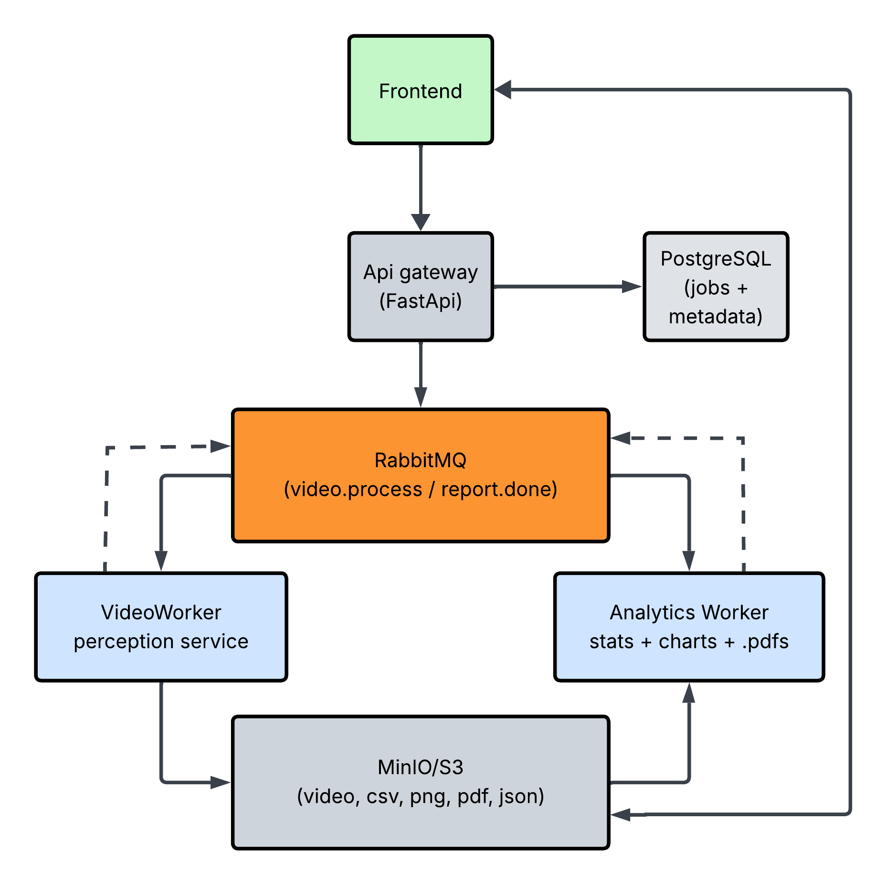

# Tennis data analysis engine

## Estructura del Proyecto

<div align="center">
    
</div>

```bash
tennis-data-analysis-engine/     <- backend + workers
├── docker-compose.yml            <- orquestador local completo
├── .env.local
├── services/
│   ├── api_gateway/
│   │   ├── docker-compose.yml
│   │   ├── Dockerfile
│   │   └── app/
│   ├── video_worker/
│   │   ├── docker-compose.yml
│   │   ├── Dockerfile
│   │   └── app/                 
│   └── analytics_worker/
│       ├── docker-compose.yml
│       ├── Dockerfile
│       └── app/
└── infra/
    ├── docker-compose.yml        <- levanta postgres + rabbitmq + minio juntos
    ├── postgres/
    │   └── docker-compose.yml
    ├── rabbitmq/
    │   └── docker-compose.yml
    └── minio/
        └── docker-compose.yml

tennis-frontend/                  <- repo independiente
├── docker-compose.yml
├── Dockerfile
└── src/
```

| Servicio           | Responsabilidad                                                                 | Tecnología                         | AWS                          |
|-------------------|--------------------------------------------------------------------------------|----------------------------------|------------------------------|
| Frontend          | UI, upload de video, visualización de resultados, descarga de reporte         | Next.js + React                  | Amplify / CloudFront + S3    |
| API gateway       | Recibir video, crear job en Postgres, publicar mensaje en cola, exponer estado del job | FastAPI                          | ECS Fargate / Lambda         |
| PostgreSQL        | Estado de jobs (pending → processing → done → failed), metadata, URLs de resultados | PostgreSQL                       | RDS                          |
| RabbitMQ          | Desacoplar upload de procesamiento, garantizar entrega, manejar reintentos    | RabbitMQ                         | Amazon MQ                    |
| Video worker      | Procesar video frame a frame, generar video anotado + CSVs, subir a MinIO, publicar video.done | FastAPI + PyTorch + YOLO         | ECS Fargate (GPU si disponible) |
| Analytics worker  | Consumir video.done, leer CSVs, calcular agregados, generar gráficos y PDF, subir a MinIO, publicar report.done | Python + matplotlib + WeasyPrint | ECS Fargate                  |
| MinIO / S3        | Almacenamiento de objetos: video anotado, CSVs, PNGs, PDF, JSON de datos para frontend | MinIO (local)                    | S3                           |


## Flujo de desarrollo

### 1. Levantar toda la infra (windows powershell)

```bash
# dentro de tennis-data-analysis-engine/
scripts/up_infra.ps1
# una vez levantada la infra, revisar que la bbdd exista, si así fuese, revisar que la tabla exista. si no, la crea
scripts/init_db.ps1
```

Estructura de la tabla `jobs` (Almacena el estado y metadata básica de cada procesamiento de video):

| Columna     | Tipo        | Restricciones        | Descripción                                      |
|------------|------------|---------------------|--------------------------------------------------|
| id         | UUID       | PRIMARY KEY         | Identificador único del job                      |
| status     | TEXT       | NOT NULL            | Estado del job (`pending`, `processing`, `done`, `failed`) |
| created_at | TIMESTAMP  | DEFAULT CURRENT_TIMESTAMP | Fecha de creación del job                        |


### 2. Levantar infra para solo un servicio

```bash
# 1. Infra primero
docker compose -f infra/docker-compose.yml up -d

# 2. Luego el servicio
docker compose up --build video_worker
```

### 3. subir una imagen

```bash
curl -X POST http://localhost:8000/upload -F "file=@C:\Users\sprou\Documents\tennis-data-analysis-engine\services\video_worker\experimentation\data\tennis_match.mp4"
```


## Crear entorno virtual
```bash
#Crear entorno virtual
python -m venv venv_tennis_data_analysis
#Activar entorno virtual (windows)
venv_tennis_data_analysis\Scripts\activate 
```

## CUDA, PyTorch y Utralytics

```bash
#Chequeo versión de drivers y toolkit
nvcc --version
nvcc: NVIDIA (R) Cuda compiler driver
Copyright (c) 2005-2023 NVIDIA Corporation
Built on Wed_Feb__8_05:53:42_Coordinated_Universal_Time_2023
Cuda compilation tools, release 12.1, V12.1.66
Build cuda_12.1.r12.1/compiler.32415258_0
#Instalar pytorch versión compatible
pip install torch torchvision torchaudio --index-url https://download.pytorch.org/whl/cu121
#Instalar ultralytics
pip install ultralytics
# Instalar roboflow para acceder a dataset de detección de pelota de tenis
pip install roboflow
```

## Datasets Tennis (videos + tennis ball track):

* https://universe.roboflow.com/viren-dhanwani/tennis-ball-detection
* Original downloaded video: https://www.youtube.com/watch?v=HjxclvUSQ88
* Tennis court detector: https://github.com/yastrebksv/TennisCourtDetector

## Inspiración

* https://www.youtube.com/watch?v=L23oIHZE14w&t=1s

## Extras:
https://www.kaggle.com/datasets/dissfya/atp-tennis-2000-2023daily-pull
Kafka (end to end): https://www.youtube.com/watch?v=yBc_UVnVhfY
